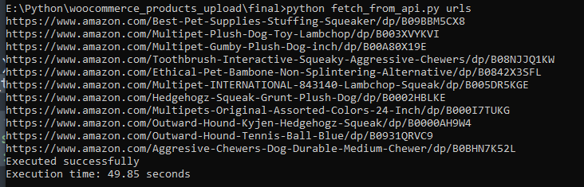
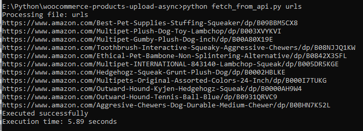

**Description:**
Python Async demo

1) Read URLs from txt file
2) Get products details from api and save in DB
3) Read products from DB and upload them to woocommerce

**Without Async**

**With Async**

**Optimization : 90%**

